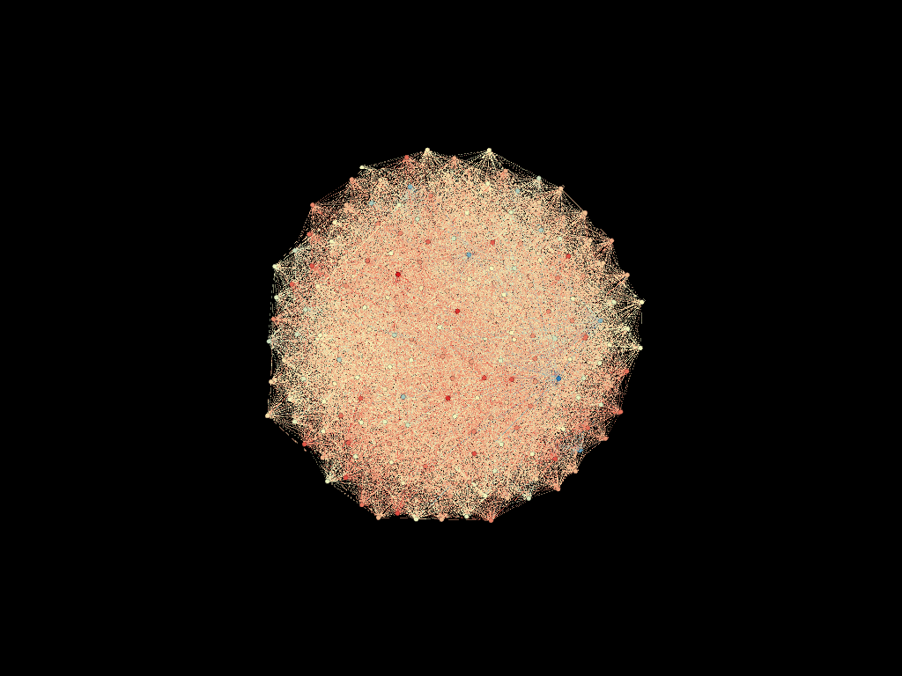

# Happy-Medium

The paper explores the polarization by media through the means of experimental design and agent-based modeling. 

Code is written in collaboration with Josh Broomberg.

Visualization: Polarization with neutral biases leads to modularity without clear opinion separation.

